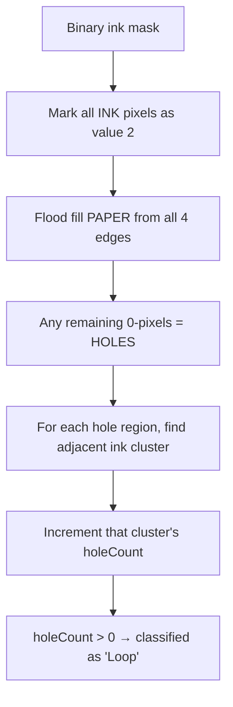

# KUTHIVARA — The Useless Scribble Analyser

> A Computer Vision web application that dissects any handwritten page into absurdly detailed forensic metrics -- a fully client-side, zero-dependency HTML/JS app that runs entirely in your browser — all running entirely inside your browser.

---

## What It Does

You upload (or draw) a handwritten page, and KUTHIVARA treats it like a crime scene. It performs **real computer vision analysis** on the ink — no AI, no server, no API calls — and presents the findings across **8 interactive report panels**, navigable like a slideshow:

| # | Panel | What It Shows |
|---|-------|---------------|
| 1 | **📏 METRES OF INK** | Calculates the actual physical length of ink strokes on the page (in metres, cm, mm, inches, feet) + fun comparisons (ants head-to-tail, spaghetti strands, notebook widths) |
| 2 | **📊 OVERVIEW** | Total ink coverage %, pixel count, cluster count, stroke count, signatures, letters, loops, ink path length, dominant color, densest quadrant |
| 3 | **🎨 INK PIGMENT SPECTROSCOPE** | Identifies the pen's ink color — HEX code, RGB, HSV (hue/saturation/value), CIELAB perceptual color space. Includes a real-time pixel inspector on hover |
| 4 | **⭕ CLOSED LOOP FINDER** | Uses topological hole detection to count enclosed loops in characters like `a, d, o, p, q`. Renders a visual map highlighting every loop in purple |
| 5 | **📦 CLUSTER BREAKDOWN** | Categorizes every connected ink blob as Signature / Alphabet / Loop / Drawn Line / Scribble, with color-coded bounding boxes on the original image |
| 6 | **🔥 DENSITY MAP** | Heatmap of local ink concentration using integral image box filtering. Shows where writing is densest |
| 7 | **📐 LINE WOBBLE & TREMOR** | PCA-based analysis of how straight your drawn lines are. Measures RMS perpendicular deviation from the fitted axis |
| 8 | **🔍 CV DIAGNOSIS** | An interactive MCQ quiz that tests whether the computer's classification matches reality |

### The Characters

- **SCRIBBLE MAN** (top-left mascot) — A stick figure who narrates the CV findings. Has *no PhD*. Is dumb. But right.
- **THE HARSH CRITIC** 🧐 (bottom-right) — Pops up after analysis to roast your handwriting with randomly selected insults.

---

## How It's Done — The Technical Pipeline

The entire application is a **single HTML file** (~1400 lines). No build tools, no frameworks, no backend. Here's the processing pipeline:

### Step 1: Image Acquisition
```
User uploads image OR draws on canvas
         ↓
Image scaled down (max 1200px) to prevent browser memory issues
         ↓
Pixel data extracted via Canvas 2D API (getImageData)
```

### Step 2: Grayscale Conversion & Thresholding
```
RGB pixels → Grayscale (luminance formula)
         ↓
Otsu-style binary threshold (adjustable via slider)
         ↓
Binary ink mask: each pixel = INK (1) or PAPER (0)
```

### Step 3: Connected Component Labeling (Flood Fill)
```
Stack-based flood fill across the binary mask
         ↓
Groups touching ink pixels into "clusters"
         ↓
For each cluster, computes:
  • Bounding box (minX, maxX, minY, maxY)
  • Centroid (cx, cy)
  • Pixel count (size)
  • Covariance matrix (sumXX, sumYY, sumXY)
```

### Step 4: PCA Elongation Analysis
```
Covariance matrix → eigenvalues via closed-form quadratic
         ↓
λ₁ / λ₂ = elongation ratio
         ↓
Primary eigenvector = stroke direction
```
This tells us if a cluster is a long thin line (high elongation) or a compact blob (low elongation).

### Step 5: Topological Hole Detection (for Closed Loops)

This is the most sophisticated algorithm in the project:



**Why this works:** If you draw the letter `o`, the white space inside the circle cannot be reached by flooding from the page edges — it's trapped. That trapped region is a topological hole. Characters like `a`, `d`, `p`, `q`, `b`, `g` all contain exactly one hole. The letter `B` contains two.

### Step 6: Scale-Invariant Classification

Each cluster is classified using metrics **relative to the image dimensions** (not raw pixel counts), so it works regardless of camera resolution:

| Classification | Rule |
|---|---|
| **Loop** | `holeCount > 0` and not page-spanning |
| **Drawn Line** | Elongation > 8× and spans > 5% of page |
| **Chaotic Scribble** | Ink density > 55% inside bounding box (solid dark blob) |
| **Signature** | Spans > 25% of page width with low density |
| **Alphabet / Letter** | Everything else with > 5 pixels |

### Step 7: Ink Color Analysis
```
For every INK pixel:
  sRGB → HSV (cylindrical color space)
  sRGB → XYZ → CIELAB (perceptual color space, D65 illuminant)
         ↓
Mean values across all ink pixels
         ↓
Hue angle + saturation → pen type classification
  (Blue ballpoint, Black gel, Red marker, etc.)
```

### Step 8: Metres of Ink Calculation
```
Total ink pixels × (mm per pixel)² = total ink area (mm²)
         ↓
Ink area ÷ pen nib width (0.5mm) = stroke path length (mm)
         ↓
Convert to metres, cm, inches, feet
         ↓
Divide by real-world object sizes for fun comparisons:
  • Ant body length (5mm)
  • Spaghetti strand (25cm)
  • A4 notebook width (21cm)
```

### Step 9: Density Heatmap
```
Integral image (summed area table) built in O(n)
         ↓
Sliding window box filter queries in O(1) per pixel
         ↓
Local density values mapped to heat color gradient
```

### Step 10: Line Wobble Analysis
```
For each elongated cluster:
  PCA eigenvector = ideal straight line axis
         ↓
  For every pixel in the stroke:
    Project onto perpendicular axis
         ↓
  RMS of perpendicular distances = "wobble score"
```

---

## Tech Stack

| Layer | Technology |
|---|---|
| **Language** | Vanilla JavaScript (ES6+) |
| **Rendering** | HTML5 Canvas 2D API |
| **Styling** | Raw CSS (brutalist design, CSS variables, animations) |
| **Image Processing** | Manual pixel manipulation via ImageData arrays |
| **Math** | Hand-rolled PCA, integral images, flood fill, CIELAB transforms |
| **Dependencies** | **Zero.** No libraries. No frameworks. No npm. |
| **Backend** | **None.** Everything runs in the browser. |

---

## Key Computer Vision Concepts Used

1. **Otsu Thresholding** — Automatic ink/paper separation
2. **Connected Component Labeling** — Grouping ink pixels into clusters via flood fill
3. **Principal Component Analysis (PCA)** — Finding the dominant direction of each stroke
4. **Integral Images (Summed Area Tables)** — O(1) local density queries
5. **Topological Hole Detection** — Counting enclosed regions via edge-flood exclusion
6. **CIELAB Color Space Transformation** — Perceptually uniform color analysis
7. **Scale-Invariant Feature Classification** — Resolution-independent shape categorization

---

> **TL;DR:** You give it a photo of your handwriting. It counts every ink pixel, groups them into clusters, measures how much ink you used in real-world units, identifies the pen color down to CIELAB coordinates, finds every closed loop in your letters, generates a density heatmap, measures how wobbly your lines are, and then a monocle-wearing critic roasts you for it.
